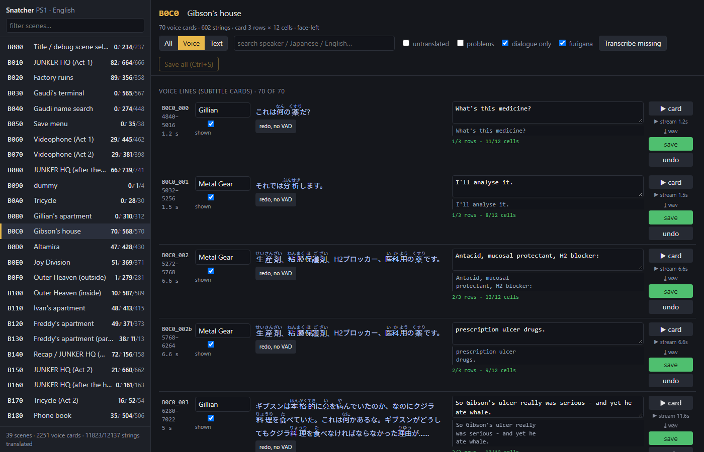
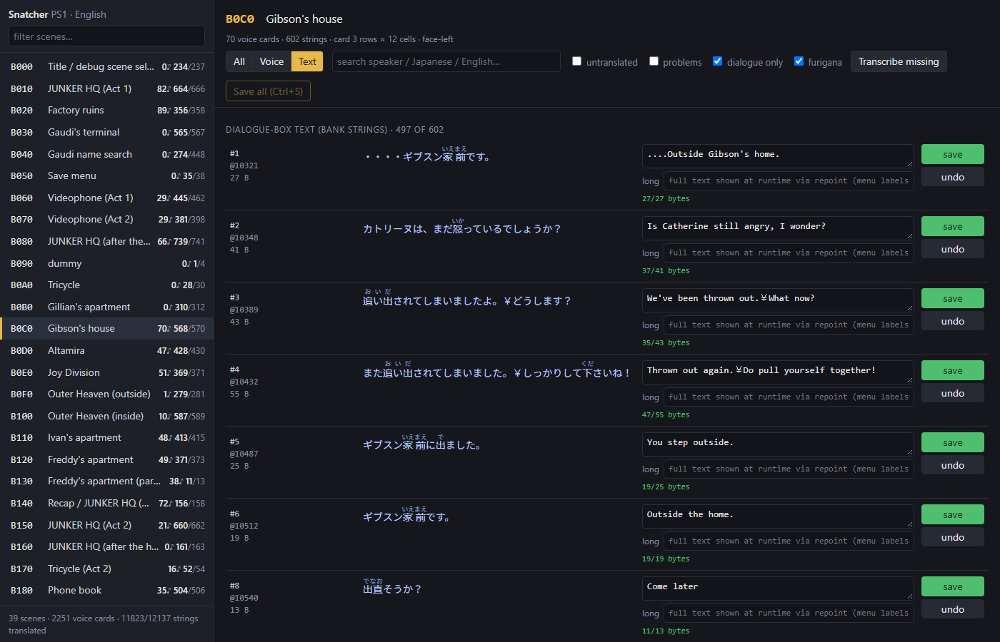
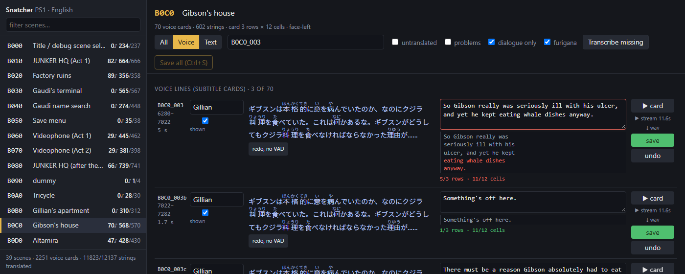

# The review tool

The first pass of this translation was machine-made. What makes it a
translation rather than machine output is the second pass: every scene is
read against the Japanese, and every line that the first pass got wrong,
or that reads like a machine wrote it, is corrected by hand. This page is
about the tool built for that pass.

It is a small local web page over the translation data. Nothing in it is
clever; the point is that reviewing a scene costs nothing but the reading.
Everything a reviewer needs for one line — who says it, what the Japanese
says, what the voice actor actually says, what the English is, and whether
the English still fits the game — is on one row, and a correction is typed
into that row and saved.

## What is on the screen

**Scenes on the left.** The game's 39 scene banks, in the game's order,
each with the number of voice lines it has and how many of its text
strings are translated. Click one to open it.

**Voice lines.** One row per subtitle card, in the order the game plays
them:

- **Speaker** — who says the line. Editable; the game's own voice band
  names the speaker, and where the script animates a listener instead
  the card is corrected here.
- **Japanese** — what is being said, from a speech-recognition pass over
  the extracted Japanese audio. The game has no text for its voiced
  lines, so this is the only written source there is. Every kanji
  carries its reading in small kana above it (furigana), so a line can
  be read without stopping at the rare ones.
- **Play** — the voice line itself. Clicking *card* plays exactly the
  span of audio the subtitle covers, decoded straight out of the disc
  image; *stream* plays the whole recording the card was cut from, for
  when a line was split across several cards and the join needs
  checking. The wav can be downloaded too. Hearing the delivery is what
  settles most of the judgement calls: whether a line is angry or tired,
  a question or a statement, how much of it fits in the time the card is
  on screen.
- **English** — the subtitle, editable in place. Under it, the card as
  the game will wrap it: the dialogue box holds three rows, and with the
  speaker's portrait beside the text a row is twelve cells wide, so the
  wrap is computed the same way the game computes it and shown row by
  row.
- **Fit** — rows used of rows available, cells used of cells available.
  Green when the card fits, red when it does not. It updates as you
  type.
- **Shown** — a card can be switched off without deleting it (a sneeze
  is not a line).

**Text.** The same layout for the dialogue-box script — the text the game
draws from its scene files rather than the voice lines. Here the Japanese
is the game's own text, and the constraint is a byte budget instead of a
row count: every string has to fit in the space the Japanese line took on
the disc, and the row shows how many bytes the English costs against the
budget, with the same red-when-over rule. Strings the engine reads back as
data (the videophone dial table, puzzle answers) are locked and cannot be
edited.

A "dialogue only" filter, on by default, hides what is not prose: the verb
and topic labels, room and item names, control records and the debug
scene list. They are all translated, but a review pass is for the lines
someone reads.

## What a correction looks like

Type the new line into the row. The fit check runs as you type, so an
English line that runs past the dialogue box is red before it is saved,
and the row preview shows exactly where the box would cut it:

The rule for a voice line that does not fit is to split it into more
cards, never to condense it — the dialogue is complete, however many
cards that takes. Save writes the one field back into the translation
data; Ctrl+Enter saves a row, Ctrl+S saves everything that changed, Esc
puts a row back.

## Transcription

Where a voice line has no transcript yet, the row says so and offers to
make one: *transcribe* runs the speech-recognition pass on that recording
(faster-whisper's medium model, primed with the game's vocabulary so the
proper nouns come out right); *redo, no VAD* runs it again with the
voice-activity filter off, for the quiet lines the filter drops. A
scene-wide button does every missing stream in one go. The result appears
in the row a few seconds later and is kept for next time.

## What it does not do

It does not build the patch, and it does not decide anything. Every
verdict it shows — the wrap, the byte count, the lock — is the build's own
rule, surfaced early so a correction that cannot ship is caught at the
desk rather than at the next build. The judgement of whether a line is
right stays with the person reading it.
